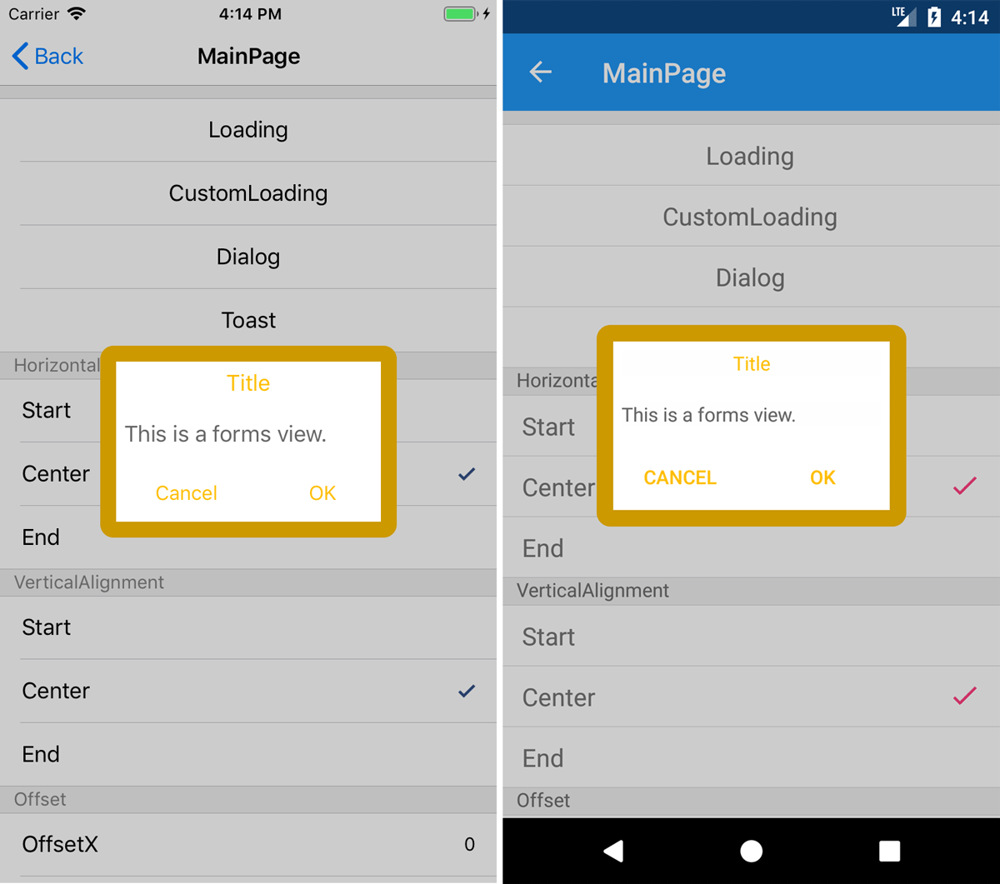
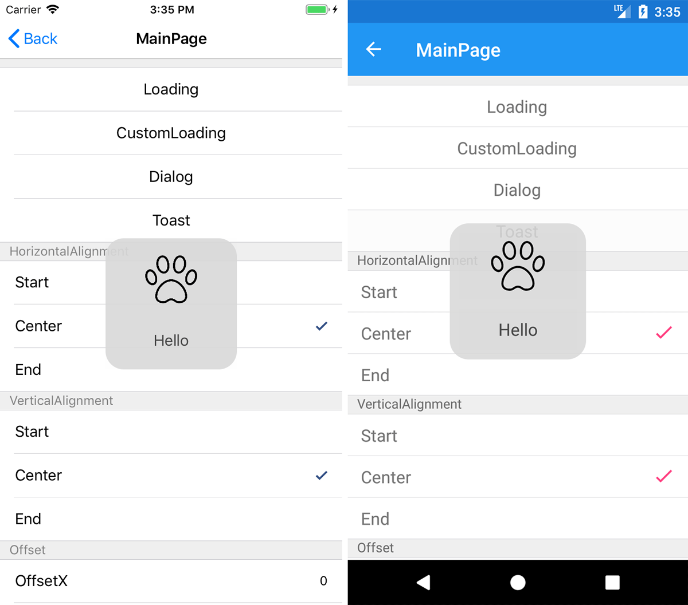
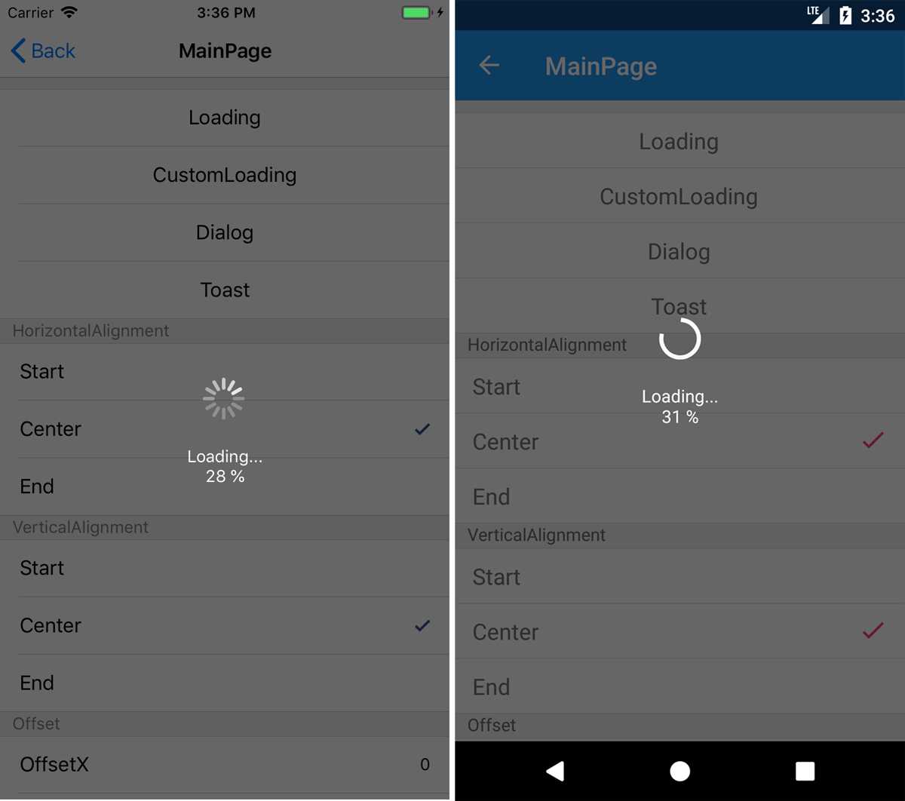
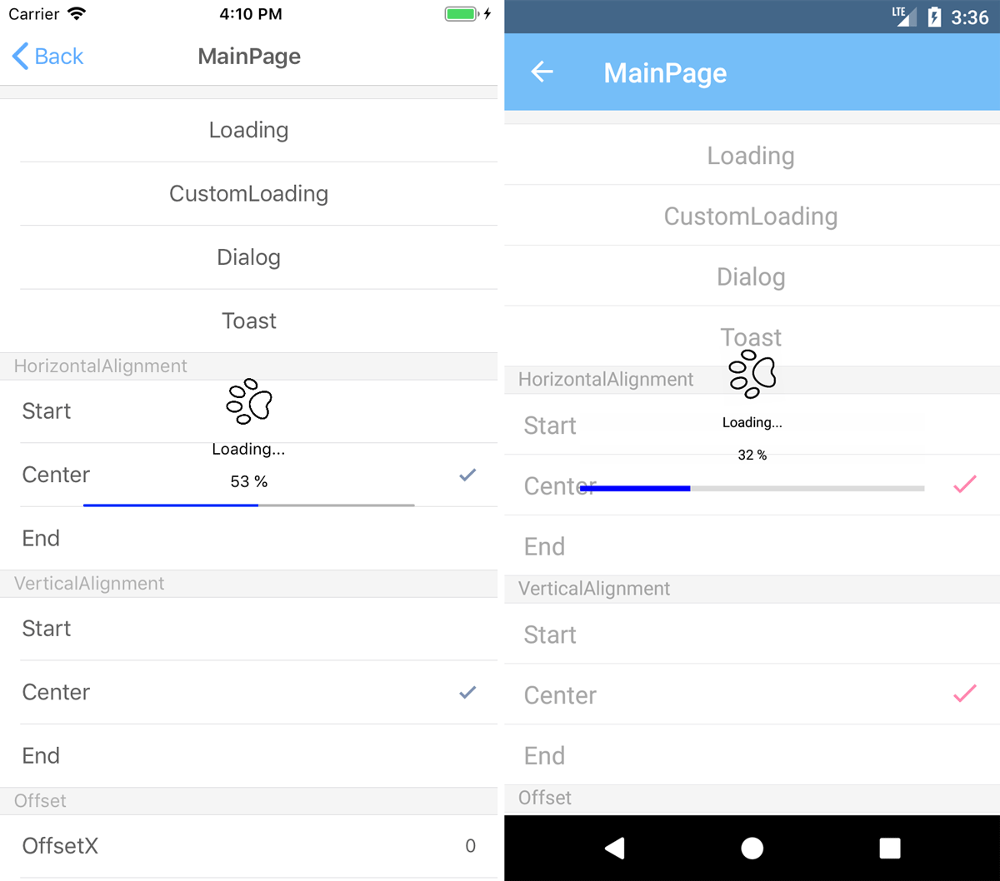

# AiForms.Dialogs for  Xamarin.Forms


**[For .NET MAUI](https://github.com/muak/AiForms.Maui.Dialogs)**

This is a collection of Custom Dialogs that can be defined with XAML for Xamarin.Forms (Android / iOS).

[Japanese](./README-ja.md)


## Available Features

* [Dialog](#dialog)
* [Toast](#toast)
* [Loading](#loading)

All dialogs can be created with XAML or c# code in a NETStandard project.
Also, they can be arranged the position where you want by specifying LayoutAlignment and Offset properties.
Optionally, the animations when the dialog is appearing or disappearing can be set.

## API Reference

* [IDialog](#idialog)
* [IReusableDialog](#ireusabledialog)
* [IToast](#itoast)
* [ILoading](#iloading)
* [IReusableLoading](#ireusableloading)
* [ExtraView](#extraview)
* [DialogView](#dialogview)
* [ToastView](#toastview)
* [LoadingView](#loadingview)

## Minimum Platform OS Version 

iOS: iOS10  
Android: version 5.1.1 (only FormsAppcompatActivity) / API22

## Demo

<a href="https://www.youtube.com/watch?feature=player_embedded&v=-DzMvQCQU1Q
" target="_blank"></a>

# Get Started

## Nuget Installation

[https://www.nuget.org/packages/AiForms.Dialogs/](https://www.nuget.org/packages/AiForms.Dialogs/)

```bash
Install-Package AiForms.Dialogs -pre
```

You need to install this nuget package to .NETStandard project and each platform project.

### For each platform project

#### iOS AppDelegate.cs

```csharp
public override bool FinishedLaunching(UIApplication app, NSDictionary options) {
    global::Xamarin.Forms.Forms.Init();
    AiForms.Dialogs.Dialogs.Init(); //need to write here
    ...
}
```

#### Android MainActivity.cs

```csharp
protected override void OnCreate(Bundle bundle)
{
    base.OnCreate(bundle);

    global::Xamarin.Forms.Forms.SetFlags("FastRenderers_Experimental");
    global::Xamarin.Forms.Forms.Init(this, bundle);
    AiForms.Dialogs.Dialogs.Init(this); //need to write here
    ...
}
```

## Dialog

This is the dialog that can be defined with XAML or c# code.
This dialog allows you to freely design the dialog content and arrange anywhere without custom renderer and effects.



### Create a DialogView

It is necessary for Dialog to create the dedicated DialogView derived from ConentView as the following:

```csharp
public partial class MyDialogView : DialogView
{
    public MyDialogView()
    {
        InitializeComponent();
    }

    public override void SetUp()
    {
        // called each opening dialog
    }

    public override void TearDwon()
    {
        // called each closing dialog
    }

    public override void RunPresentationAnimation()
    {
        // define opening animation
    }

    public override void RunDismissalAnimation()
    {
        // define closing animation
    }

    public override void Destroy()
    {
        // define clean up process.
    }

    void Handle_OK_Clicked(object sender, System.EventArgs e)
    {
        // send complete notification to the dialog.
        DialogNotifier.Complete();
    }

    void Handle_Cancel_Clicked(object sender, System.EventArgs e)
    {
        // send cancel notification to the dialog.
        DialogNotifier.Cancel();
    }
}
```

```xml
<extra:DialogView
    xmlns="http://xamarin.com/schemas/2014/forms" 
    xmlns:x="http://schemas.microsoft.com/winfx/2009/xaml" 
    xmlns:extra="clr-namespace:AiForms.Dialogs.Abstractions;assembly=AiForms.Dialogs.Abstractions"
    x:Class="Sample.Views.MyDialogView"
    CornerRadius="10" OffsetX="0" OffsetY="0" UseCurrentPageLocation="false" 
    VerticalLayoutAlignment="Center" HorizontalLayoutAlignment="Center" >

    <StackLayout WidthRequest="200">
        <Label Text="{Binding Title}" />
        <Button Text="Cancel" Clicked="Handle_Cancel_Clicked"/>
        <Button Text="OK" Clicked="Handle_OK_Clicked" />
    </StackLayout>

</extra:DialogView>
```

> You should make use of ContentView Xaml Template with Visual Studio.

### Show Dialog

Once a DialogView defined, IDialog methods can be used from wherever.
To show a dialog, you get an IDialog instance from AiForms.Dialogs.Dialog.Instance and call its ShowAsync method.

```csharp
using AiForms.Dialogs;

public async Task SomeMethod()
{
    var ret = await Dialog.Instance.ShowAsync<MyDialogView>(new{Title="Hello"});
    // If canceled, ret is false; Otherwise is true.
    // Optionally, view model can be passed to the dialog view instance.
    // When the dialog is closed, all related resource automatically are disposed.

    // Also, IReusableDialog that keeps the state can be created.
    var reusableDialog = Dialog.Instance.Create<MyDialogView>();

    ret = await reusableDialog.ShowAsync();
    // Even if the dialog is closed, disposing process is not executed.

    // ShowAsync can be used any number of times until disposing it.
    reusableDialog.Dispose();
}
```

## Toast

This is the dialog that disappears after some second, which is similar to Android Native Toast Control.
This can be defined with XAML or c# code and allows you to freely design the content and arrange anywhere.



### Create a ToastView

It is necessary for Toast to create the dedicated ToastView derived from ConentView as the following:

```csharp
public partial class MyToastView : ToastView
{
    public MyToastView()
    {
        InitializeComponent();
    }

    // define appearing animation
    public override void RunPresentationAnimation() {}

    // define disappearing animation
    public override void RunDismissalAnimation() {}

    // define clean up process.
    public override void Destroy() {}
}
```

```xml
<extra:ToastView xmlns="http://xamarin.com/schemas/2014/forms"
             xmlns:x="http://schemas.microsoft.com/winfx/2009/xaml" 
             xmlns:extra="clr-namespace:AiForms.Dialogs.Abstractions;assembly=AiForms.Dialogs.Abstractions"
             x:Class="Sample.Views.MyToastView"
             HorizontalLayoutAlignment="Center"
             VerticalLayoutAlignment="Center"
             OffsetX="50" OffsetY="50" Duration="{Binding Duration}" >

    <StackLayout WidthRequest="150" Spacing="0">
        <Label Text="{Binding Title}" />
    </StackLayout>
</extra:ToastView>
```

### Show Toast

Once a ToastView is defined, IToast methods can be used from wherever.
To show a Toast, you get an IToast instance from AiForms.Dialogs.Toast.Instance and call its Show method.

```csharp
using AiForms.Dialogs;

public async Task SomeMethod()
{
    Toast.Instance.Show<MyToastView>(new{Title="Hello",Duration=1500});
    // Optionally, view model can be passed to the toast view instance.
}
```

## Loading

This is the dialog that can't be close by a user, which is appropriate for the notification of loading progress.
This has two modes, one is default built-in dialog, the other is custom dialog using LoadingView the same as Dialog or Toast.
LoadingView allows you to freely design the content and arrange anywhere.
Both of these have the function that notifies progress to the view.






### Show default Loading Dialog

To show a Default Loading Dialog, you get an ILoading instance from AiForms.Dialogs.Loading.Instance and call its StartAsync method.

The following code describes how to use default Loading Dialog:

```csharp
using AiForms.Dialogs;
using AiForms.Dialogs.Abstractions;
public async Task SomeMethod()
{
    // Loading settings
    Configurations.LoadingConfig = new LoadingConfig {
        IndicatorColor = Color.White,
        OverlayColor = Color.Black,
        Opacity = 0.4,
        DefaultMessage = "Loading...",
    };

    await Loading.Instance.StartAsync(async progress =>{
        // some heavy process.
        for (var i = 0; i < 100; i++)
        {
            await Task.Delay(50);
            // can send progress to the dialog with the IProgress.
            progress.Report((i + 1) * 0.01d);
        }
    });
}
```

### Create custom loading view

It is necessary for Custom Loading to create the dedicated LoadingView derived from ConentView as the following:

```csharp
public partial class MyLoadingView : LoadingView
{
    Animation animation;

    public MyLoadingView()
    {
        InitializeComponent();

        animation = new Animation(v=>{
            image.Rotation = 360 * v;

            if(v <= 0.3){
                image.Scale = 1.0 - 0.5 * v / 0.3;
            }
            else if(v <= 0.6){
                image.Scale = 0.5 + 0.8 * (v - 0.3) / 0.3;
            }
            else {
                image.Scale = 1.3 - 0.2 * (v - 0.6) / 0.4;
            }
        },0,1,Easing.Linear,()=>{
            
        });
    }

    // Start Loading animation 
    public override void RunPresentationAnimation()
    {
        this.Animate("sample", animation, 16, 1440, null, (v, c) => {
            image.Rotation = 0;
            image.Scale = 1;
        }, () => true);
    }

    // Stop animation
    public override void RunDismissalAnimation()
    {
        this.AbortAnimation("sample");
    }

    // Clean up
    public override void Destroy() {}
}
```

```xml
<extra:LoadingView 
    xmlns="http://xamarin.com/schemas/2014/forms"
    xmlns:x="http://schemas.microsoft.com/winfx/2009/xaml" 
    xmlns:extra="clr-namespace:AiForms.Dialogs.Abstractions;assembly=AiForms.Dialogs.Abstractions"
    x:Class="Sample.Views.MyLoadingView" 
    x:Name="Me" 
    OverlayColor="#2000FF00" >
    <StackLayout WidthRequest="60" HeightRequest="60" Spacing="0">
        <Image x:Name="image" WidthRequest="36" HeightRequest="36" Source="icon.png" />
        <Label Text="{Binding Message}" FontSize="Micro" />
        <Label Text="{Binding Progress,Source={x:Reference Me},StringFormat='{0:P0}'}" FontSize="Micro" />        
    </StackLayout>
</extra:LoadingView>
```

> LoadingView has a Progress property of type double, the progress can be expressed by binding the Progress property of itself.

### Show a custom loading dialog

Once a LoadingView is defined, you can create an IReusableLoading instance using ILoading.Create method. Using the StartAsync method of the IReusableLoading instance can show a custom loading dialog.

```csharp
using AiForms.Dialogs;

public async Task SomeMethod()
{
    // Create a IReusableLoading instance.
    var reusableLoading = Loading.Instance.Create<MyLoadingView>();
    // Optionally, view model can be passed to the dialog view instance.

    await reusableLoading.StartAsync(async progress => {
        // heavy process
        await Task.Delay(1000);
        // can send progress to the LoadingView with the IProgress.
        progress.Report(1.0);
    });

    // StartAsync can be used any number of times until disposing it.
    reusableLoading.Dispose();
}
```

# API Reference

## IDialog

### Methods

#### Task`<bool>` ShowAsync`<T>`(object viewModel = null)
#### Task`<bool>` ShowAsync(DialogView view, object viewModel = null)
    
* A dialog is shown by specifying a Type or a view instance. Optionally, A view model can be passed to in order to bind.
* If canceled, return is false; Otherwise true.
* When the dialog is closed, all related resource automatically are disposed.

#### IReusableDialog Create`<TView>`(object viewModel = null) 
#### IReusableDialog Create(DialogView view, object viewModel = null)

* A IReusableDialog instance is created by specifying a Type or a view instance. Optionally, A view model can be passed to in order to bind.

## IReusableDialog

### Methods

#### Task`<bool>` ShowAsync()

* A dialog is shown.
* If canceled, return is false; Otherwise true.
* Even if the dialog is closed, disposing process is not executed.

#### Dispose()

## IToast

### Methods

#### void Show`<TView>`(object viewModel = null)

* A toast is shown by specifying a Type. Optionally, A view model can be passed to in order to bind.

## ILoading

### Methods

#### Task StartAsync(Func`<IProgress<double>, Task>` action, string message = null, bool isCurrentScope = false)

* A loading dialog is shown and awaited a Task.
* The action is a Func to do target process and return Task. This function has an IProgress instance as a parameter, it allows you to report the progress.
* The message is any string to show below the loading indicator.
* The isCurrentScope is a flag to change the dialog parent view. If true, the dialog parent changes from KeyWindow to current ViewController's view. This only works on iOS.

#### void Show(string message = null, bool isCurrentScope = false)

* A loading dialog is shown without awaiting.

#### void Hide()

* A loading dialog is hidden.

#### void SetMessage(string message)

* The message is changed.

#### IReusableLoading Create`<TView>`(object viewModel = null)
#### IReusableLoading Create(LoadingView view, object viewModel = null)

* A IReusableLoading instance is created by specifying a Type or a view instance. Optionally, A view model can be passed to in order to bind.

## IReusableLoading

### Methods

#### Task StartAsync(Func`<IProgress<double>, Task>` action, bool isCurrentScope = false)

* A custom loading dialog is shown and awaited a Task.

#### void Show(bool isCurrentScope = false)

* A custom loading dialog is shown without awaiting.

#### void Hide()

* A custom loading dialog is hidden.


## LoadingConfig

This is global default loading dialog settings.
Once this instance is set to AiForms.Dialogs.Abstractions.Configurations static property, these will be enabled.

> Note that these settings are not used when a custom loading is used.

### Properties

* OffsetX
    * The adjustment relative value from the horizontal layout position. 
* OffsetY
    * The adjustment relative value from the vertical layout position.
* IndicatorColor
    * The icon color for Loading indicator.
* FontSize
    * The size for Loading description string.
* FontColor
    * The color for Loading description string.
* OverlayColor
    * The color of the dialog overlay view.
* Opacity
    * The entire opacity. (0-1)
* DefaultMessage
    * The default string for loading description.
* ProgressMessageFormat
    * The string format for loading description.
    * e.g. ``{0}\n{1:P0}`` 0:message 1:progress
* IsReusable
    * The bool value whether loading view is reused. (default: false)
    * Each time a dialog is closed, the instance is disposed of. But if this value turns true, the instance will be reused, even if a dialog is closed, it won't be disposed of.

## ExtraView

This is base class of DialogView, ToastView, and LoadingView.

This view is used to specify HorizontalLayoutAlignment, VerticalLayoutAlignment, OffsetX, OffsetX and determine itself position.
This view can be set a VisualElement.

Also, the animations the time a dialog appears and disappears, and the cleaning up process the time the dialog is destroyed can be written in virtual methods.

### Common Propoerties

* ProportionalWidth
    * The double value in proportion to the Device width. (0-1)
    * In case not specified, the WidthRequest value or AutoSizing is used.
* ProportionalHeight
    * The double value in proportion to the Device height. (0-1)
    * In case not specified, the HeightRequest value or AutoSizing is used.
* VerticalLayoutAlignment
    * The vertical position enumeration value (Start / Center / End / Fill) (default: Center)
* HorizontalLayoutAlignment
    * The horizontal position enumeration value (Start / Center / End / Fill) (default: Center)
* OffsetX
    * The adjustment relative value from the horizontal layout position. 
* OffsetY
    * The adjustment relative value from the vertical layout position.
* CornerRadius
    * The value of a dialog corner radius.
* AutoRotateForIOS
    * Whether the screen Auto rotate is enabled for iOS. (default: true)

### Common Virtual Methods

* RunPresentationAnimation
    * Write the animation process the time a dialog appears.
* RunDismissalAnimation
    * Write the animation process the time a dialog disappears.
* Destroy
    * Write the process of cleaning up itself view, which is called when the dialog is destroyed. 

> Note that animation duration is assumed for 250ms. If it is set larger than the time, the animation may be aborted.

## DialogView

This view is used in order that IDialog or IReusableDialog shows a dialog.
This can be used All ExtraView properties and virtual methods and the following properties and virtual methods.

### Properties

* IsCanceledOnTouchOutside
    * The bool value of whether canceling when out of the dialog is touched. (default: ture)
* OverlayColor
    * The background color out of the dialog.
* UseCurrentPageLocation
    * The bool value of whether the base location of HorizontalLayoutAlignment and VerticalLayoutAlignment is the current page area or the window area.
    * If it is true, each edge will be not window's edge but current page edge.

#### DialogNotifier

* The controller to notify cancelation or completion from the view to the IDialog instance.
* In the view, if tapping a button make the dialog complete or cancel, write as the follwing code:

```csharp
void Handle_OK_Clicked(object sender, System.EventArgs e)
{
    DialogNotifier.Complete();
}

void Handle_Cancel_Clicked(object sender, System.EventArgs e)
{
    DialogNotifier.Cancel();
}
```

Altenatively, you can use it in a ViewModel.

```Xml
<ex:DialogView DialogNotifier="{Binding Notifier}">
```

```csharp
public IDialogNotifier Notifier { get; set; }

async void Show()
{
    await Dialog.Instance.ShowAsync<MyDialogView>(this);
}

void Complete()
{
    Notifier.Complete();
}
void Cancel()
{
    Notifier.Cancel();
}
```

### Virtual Methods

* SetUp
    * Write the process of preparing for itself, which is called just before each opening the dialog for IReusableDialog.
* TearDown
    * Write the process of preparing for the next time and cleaning up, which is called just after each closing the dialog for IReusableDialog.

## ToastView

This view is used in order that IToast shows a toast.
This can be used All ExtraView properties and virtual methods and the following properties.

> Note that a toast can't go over each window edge using OffsetX and OffsetY properties on Android.

### Properties

* Duration
    * The millisecond value until disappearing a toast. (1-3500) (default:1500)

## LoadingView

This view is used in order that IReusableLoading shows a loading dialog.
This can be used All ExtraView properties and virtual methods and the following properties.

### Properties

* Progress
    * The value of type double for expressing progress.
    * This value can be used to express the progress in your custom view.
* OverlayColor
    * The background color out of the dialog.

## License

The MIT Licensed.
